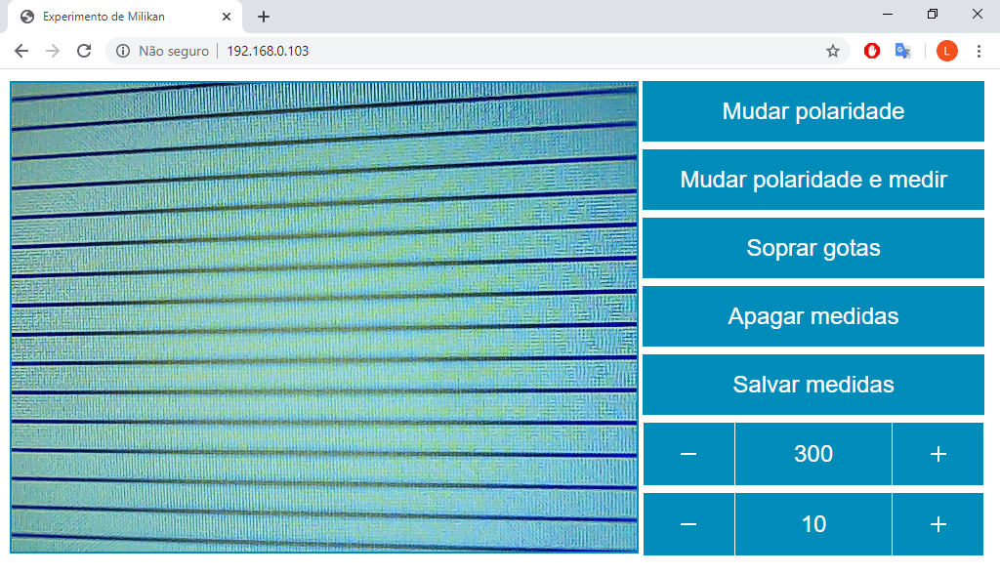

# Projeto_Milikan

## Características

* Arduino para controle de chaves.
* Programa em Python para comunicar-se com Arduino, coletar tempos, calcular: carga e raio da gotículas.
* Interface web.

## Snapshot

